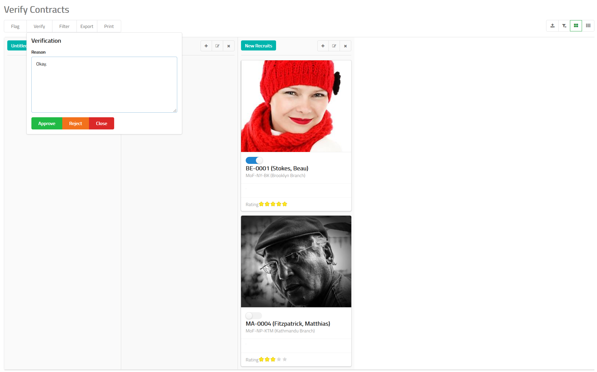

# Contract Verification

When you create a new contract, it is sent to the verification
queue. In the verification queue, you can decide to either
approve a contract or reject it stating a reason why
it was approved or rejected.

## How to Approve or Reject a Contract?

- Navigate to contract verification feature in MixERP.
- Select an employee which you want to verify 
by clicking on the the toggle
button.
- Click **Verify** button on the top.
- Provide a reason why you are approving or rejecting this contract.
- Click **Approve** or **Reject**.

## Related Topics
* [Human Resource Management Documentation](index.md)
* [MixERP Documentation](../index.md)
