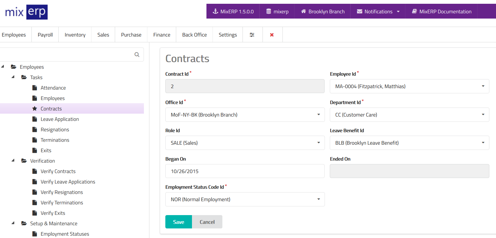

# Employee Contracts

<table class="ui padded compact attached small blue table">
    <tr>
        <th>
            Contract Id
        </th>
        <td>
            This will be automatically generated.
        </td>
    </tr>
    <tr>
        <th>
            Employee Id
        </th>
        <td>
            Select an employee from the list.
        </td>
    </tr>
    <tr>
        <th>Office Id
        </th>
        <td>Select the office where this contract is effective for.
        </td>
    </tr>
    <tr>
        <th>Department Id
        </th>
        <td>Select the department related to the employee.
        </td>
    </tr>
    <tr>
        <th>Role Id
        </th>
        <td>Select the role of the employee.
        </td>
    </tr>
    <tr>
        <th>Leave Benefit Id
        </th>
        <td>Select a leave benefit from the list.
        </td>
    </tr>
    <tr>
        <th>Began On
        </th>
        <td>Enter the contract beginning date.
        </td>
    </tr>
    <tr>
        <th>Ended On
        </th>
        <td>This field is read-only.
        </td>
    </tr>
    <tr>
        <th>Employment Status Code Id
        </th>
        <td>Select the employment status from the the list.
        </td>
    </tr>
</table>

## Related Topics
* [Human Resource Management Documentation](index.md)
* [MixERP Documentation](../index.md)