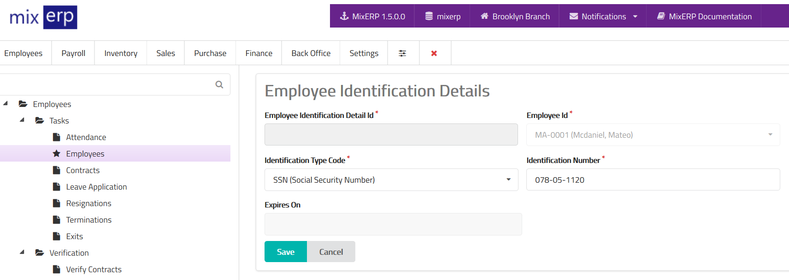

# Employee Identification Details

Employee idenfication details enables you enter various idenfication
information of an employee. Example: social security number,
driving license number, passport number, etc.

<table class="ui padded compact attached small blue table">
    <tr>
        <th>
            Employee Idenfication Detail Id
        </th>
        <td>
            This will be automatically generated.
        </td>
    </tr>
    <tr>
        <th>
            Employee Id
        </th>
        <td>
            This will be automatically selected.
        </td>
    </tr>
    <tr>
        <th>Identification Type Code
        </th>
        <td>Select the identification type from the list.
        </td>
    </tr>
    <tr>
        <th>Identification Number
        </th>
        <td>
            Enter the identification number related to the identification
            type you had chosen.
        </td>
    </tr>
    <tr>
        <th>Expires On
        </th>
        <td>Enter the expiry date of this identification detail.
        Please note that this field is diabled for identification
        details such as social security which cannot expire.
        </td>
    </tr>
</table>

## Related Topics
* [Employee Management](employee-managment.md)
* [Human Resource Management Documentation](index.md)
* [MixERP Documentation](../index.md)
