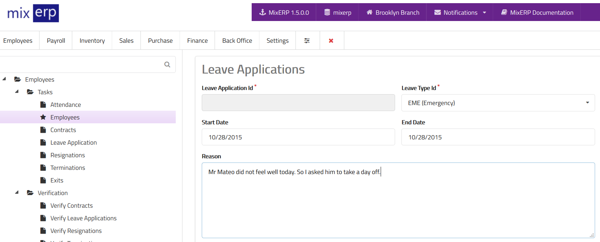

# Leave Application (Non ESS)

To enter the leave application of any employee, please follow these steps:

- Login to MixERP.
- Click **Employees** menu.
- Click **Tasks** menu.
- Click **Employees** menu.
- Select an employee from the list.
- Click **View** button. You will be redirected to employee information page.
- Click **Leave Applications** button.
- Click **Add New**.

Please note that the leave must be approved first in order
to become effective.

<table class="ui padded compact attached small blue table">
    <tr>
        <th>
            Leave Application Id
        </th>
        <td>
            This will be automatically generated.
        </td>
    </tr>
    <tr>
        <th>
            Leave Type Id
        </th>
        <td>
            Select the leave type from the list.
        </td>
    </tr>
    <tr>
        <th>
            Start Date
        </th>
        <td>
            Enter the date from which the leave will start.
        </td>
    </tr>
    <tr>
        <th>
            End Date
        </th>
        <td>
            Enter the date on which the leave will end.
        </td>
    </tr>
    <tr>
        <th>Reason
        </th>
        <td>Enter the reason for applying for leave.
        </td>
    </tr>
</table>

## Related Topics
* [Employee Management](employee-managment.md)
* [Human Resource Management Documentation](index.md)
* [MixERP Documentation](../index.md)
