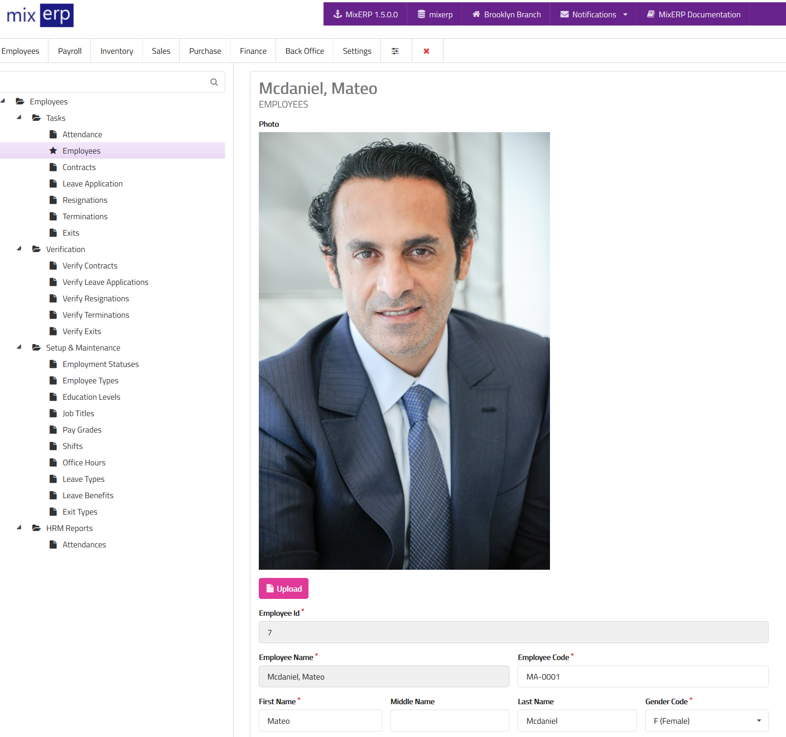
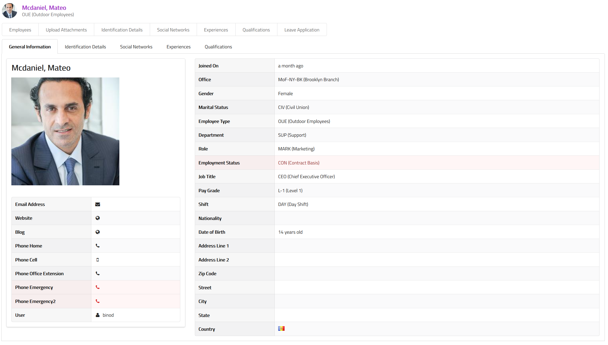

# Employee Management

With MixERP, managing your employees is an easy, natural, and 
continuous task.

## Adding a New Employee
To create a new employee, press the "Add New" button.

### Fields

<table class="ui padded compact attached small blue table">
    <tr>
        <th>
            Employee Id
        </th>
        <td>
            This will be automatically generated.
        </td>
    </tr>
    <tr>
        <th>
            Employee Name
        </th>
        <td>
            This will be automatically generated.
        </td>
    </tr>
    <tr>
        <th>Employee Code
        </th>
        <td>Enter the alpha-numeric code of this employee.
        </td>
    </tr>
    <tr>
        <th>First Name
        </th>
        <td>The first name of this employee.
        </td>
    </tr>
    <tr>
        <th>Middle Name
        </th>
        <td>The middle name of this employee, if applicable.
        </td>
    </tr>
    <tr>
        <th>Last Name
        </th>
        <td>The last name of this employee, if applicable.
        </td>
    </tr>
    <tr>
        <th>Gender Code
        </th>
        <td>Select a gender from the list.
        </td>
    </tr>
    <tr>
        <th>Marital Status Id
        </th>
        <td>The current marital status of the employee. Example: married, single, divorced.
        </td>
    </tr>
    <tr>
        <th>Joined On
        </th>
        <td>Enter the date when employee joined (or will join) the service.
        </td>
    </tr>
    <tr>
        <th>Office Id
        </th>
        <td>Select the office where this employee will be working.
        </td>
    </tr>
    <tr>
        <th>User Id
        </th>
        <td>Select the user associated with this employee. You can leave this field empty.
However, if you provide a user for this employee, the employee will be able
to use Employee Self Service feature.
        </td>
    </tr>
    <tr>
        <th>Employee Type Id
        </th>
        <td>Select employee type from the list.
        </td>
    </tr>
    <tr>
        <th>Current Department Id
        </th>
        <td>Select the current department this employee works under.
        </td>
    </tr>
    <tr>
        <th>Current Role Id
        </th>
        <td>Select the current role of this employee.
        </td>
    </tr>
</table>

### Employment Information

<table class="ui padded compact attached small blue table">
    <tr>
        <th>Current Employment Status Id
        </th>
        <td>Select the current employment status of this employee. Example: On contract,
permanent job, internship, etc.
        </td>
    </tr>
    <tr>
        <th>Current Job Title Id
        </th>
        <td>Select the current job title of this employee. Example: CEO.
        </td>
    </tr>
    <tr>
        <th>Current Pay Grade Id
        </th>
        <td>Select the current pay grade of this employee.
        </td>
    </tr>
    <tr>
        <th>Current Shift Id
        </th>
        <td>Select the current shift employee work on. Example: morning shift, day shift,
night shift.
        </td>
    </tr>
    <tr>
        <th>Nationality Code
        </th>
        <td>Select the nationality of this employee.
        </td>
    </tr>
    <tr>
        <th>Date of Birth
        </th>
        <td>Enter the date of birth of this employee.
        </td>
    </tr>
</table>

### Bank Details

<table class="ui padded compact attached small blue table">
    <tr>
        <th>Bank Account Number      
        </th>
        <td>Enter the bank account number of this employee's bank account.
        </td>
    </tr>
    <tr>
        <th>Bank Name
        </th>
        <td>Enter the name of the bank on which this employee has account.
        </td>
    </tr>
    <tr>
        <th>Bank Branch Name
        </th>
        <td>Enter the name of the bank's branch office which operates this employee's
bank account.
        </td>
    </tr>
    <tr>
        <th>Bank Reference Number           
        </th>
        <td>Enter the reference number provided by the employee's bank which is related
to the bank account.
        </td>
    </tr>
    <tr>
        <th>Account Id    
        </th>
        <td>Select the account on which salary and/or wage will be posted to. If you leave
this empty, the salary will be posted to <a href="../payroll/salary-setup.md">payroll account id</a> instead.
        </td>
    </tr>
</table>

### Address Information

Enter employee address: 

**Zip Code, Address Line 1, Address Line 2, Street, City, State, and Country.**

### Contact Information

Enter contact information: 

**Phone (Home), Phone (Cell), Phone (Office Extension), Phone (Emergency), Phone(Emergency2), Email Address, Web Site, and Blog.**

### Personal Information

<table class="ui padded compact attached small blue table">
    <tr>
        <th>Is Smoker            
        </th>
        <td>Indicates that the employee is addicted to smoking.
        </td>
    </tr>
    <tr>
        <th>Is Alcoholic
        </th>
        <td>Indicates that the employee is addicted to alcohol.
        </td>
    </tr>
    <tr>
        <th>Low Vision
        </th>
        <td>Indicates that the employee has a low vision.
        </td>
    </tr>
    <tr>
        <th>Uses Wheelchair
        </th>
        <td>Indicates that the employee uses wheelchair.
        </td>
    </tr>
    <tr>
        <th>Hard of Hearing
        </th>
        <td>Indicates that the employee has difficulty hearing.
        </td>
    </tr>
    <tr>
        <th>Is Aphonic
        </th>
        <td>Indicates that the employee does not speak.
        </td>
    </tr>
    <tr>
        <th>Is Cognitively Disabled
        </th>
        <td>Indicates that the employee is cognitively disabled.
        </td>
    </tr>
    <tr>
        <th>Is Autistic
        </th>
        <td>Indicates that the employee is autistic.
        </td>
    </tr>
</table>

# Mangaing Your Employees

As soon as you create a new employee, he/she goes
to the board named "Untitled". Using the Kanban (+) button, you can define
unlimited number of boards.

You can now move your employee left or right, back and forth, depending
on whatever seems meaningful to you.

# Employee Information

To view information of an employee, click on the view button.

The employee information view enables you to manage the following information
related to the employee :

- [Attachments](#)
- [Idenfication Details](employee-identification-details.md)
- [Social Networks](employee-social-networks.md)
- [Experiences](employee-experiences.md)
- [Qualifications](employee-qualifications.md)
- [Leave Application](employee-leave-application.md)

## Related Topics
* [Human Resource Management Documentation](index.md)
* [MixERP Documentation](../index.md)
