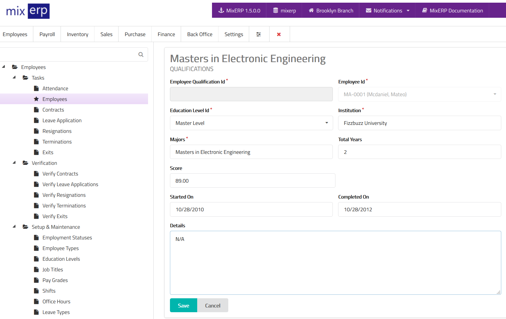

# Employee Qualifications

<table class="ui padded compact attached small blue table">
    <tr>
        <th>
            Employee Qualification Id
        </th>
        <td>
            This will be automatically generated.
        </td>
    </tr>
    <tr>
        <th>
            Employee Id
        </th>
        <td>
            This will be automatically selected.
        </td>
    </tr>
    <tr>
        <th>Institution Name
        </th>
        <td>Enter the name of the institution.
        </td>
    </tr>
    <tr>
        <th>Majors
        </th>
        <td>Enter qualification majors.
        </td>
    </tr>
    <tr>
        <th>Score
        </th>
        <td>Enter the score obtained.
        </td>
    </tr>
    <tr>
        <th>Started On
        </th>
        <td>Enter the start date of this qualification.
        </td>
    </tr>
    <tr>
        <th>Ended On
        </th>
        <td>Enter the end date of this qualification.
        </td>
    </tr>
    <tr>
        <th>Details
        </th>
        <td>If applicable, enter specific details related to this qualification.
        </td>
    </tr>
</table>

## Related Topics
* [Employee Management](employee-managment.md)
* [Human Resource Management Documentation](index.md)
* [MixERP Documentation](../index.md)
