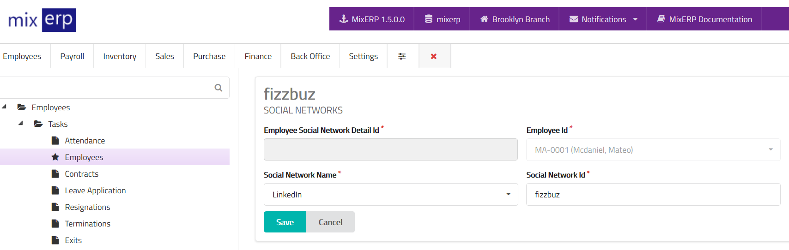

# Employee Social Networks

<table class="ui padded compact attached small blue table">
    <tr>
        <th>
            Employee Social Network Id
        </th>
        <td>
            This will be automatically generated.
        </td>
    </tr>
    <tr>
        <th>
            Employee Id
        </th>
        <td>
            This will be automatically selected.
        </td>
    </tr>
    <tr>
        <th>Social Network Name
        </th>
        <td>Select the social network from the list.
        </td>
    </tr>
    <tr>
        <th>Social Network Id
        </th>
        <td>Enter social network profile id or the full link to the social profile.
        </td>
    </tr>
</table>

## Related Topics
* [Employee Management](employee-managment.md)
* [Human Resource Management Documentation](index.md)
* [MixERP Documentation](../index.md)
