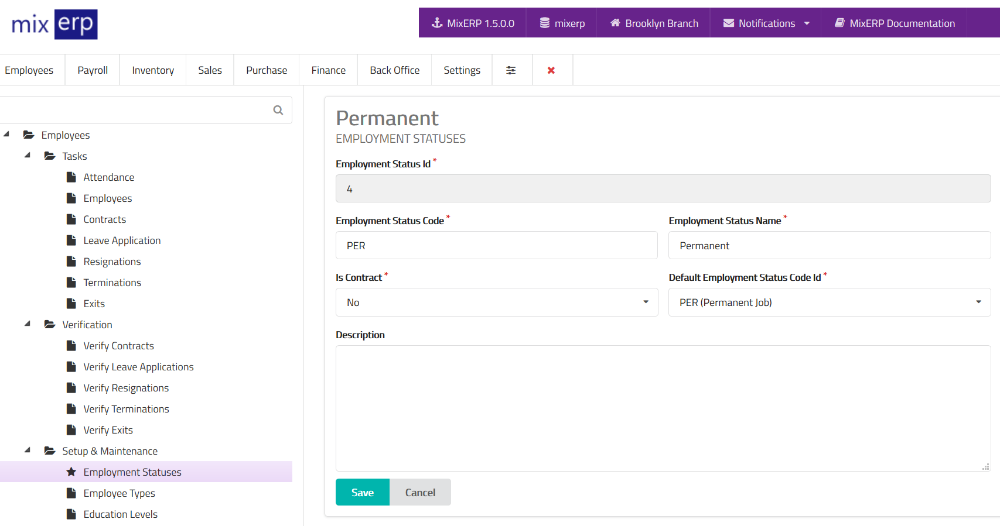

# Employment Statuses

<table class="ui padded compact attached small blue table">
    <tr>
        <th>
            Employment Status Id
        </th>
        <td>
            This will be automatically generated.
        </td>
    </tr>
    <tr>
        <th>
            Employment Status Code
        </th>
        <td>
            Enter an alpha-numeric code for this employment status.
        </td>
    </tr>
    <tr>
        <th>
            Employment Status Name
        </th>
        <td>
            Enter the employment status name.
        </td>
    </tr>
    <tr>
        <th>Is Contract
        </th>
        <td>
            Indicates that this employment status is a
            contract-type employment.
        </td>
    </tr>
    <tr>
        <th>Default Employment Status Code
        </th>
        <td>
            Select employment status code from the list.
        </td>
    </tr>
    <tr>
        <th>Description
        </th>
        <td>Enter the description of this employment status.
        </td>
    </tr>
</table>

## Related Topics
* [Human Resource Management Documentation](index.md)
* [MixERP Documentation](../index.md)
