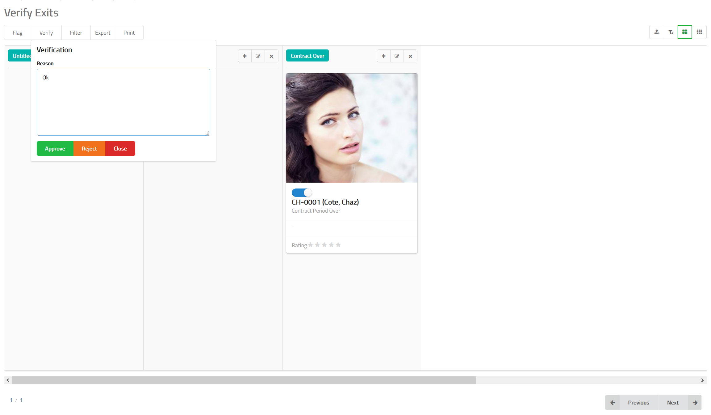

# Exit Verification

Once an employee exit is posted to MixERP, it is sent to the verification
queue. In the verification queue, you can decide to either
approve the exit or reject it stating a reason why
you want to do that.

## How to Approve or Reject an Exit?

- Navigate to exit verification feature in MixERP.
- Select the card which contains the exit
you want to verify by clicking on the the toggle button.
- Click **Verify** button on the top.
- Provide a reason why you are approving or rejecting this exit.
- Click **Approve** or **Reject**.

## Related Topics
* [Human Resource Management Documentation](index.md)
* [MixERP Documentation](../index.md)
