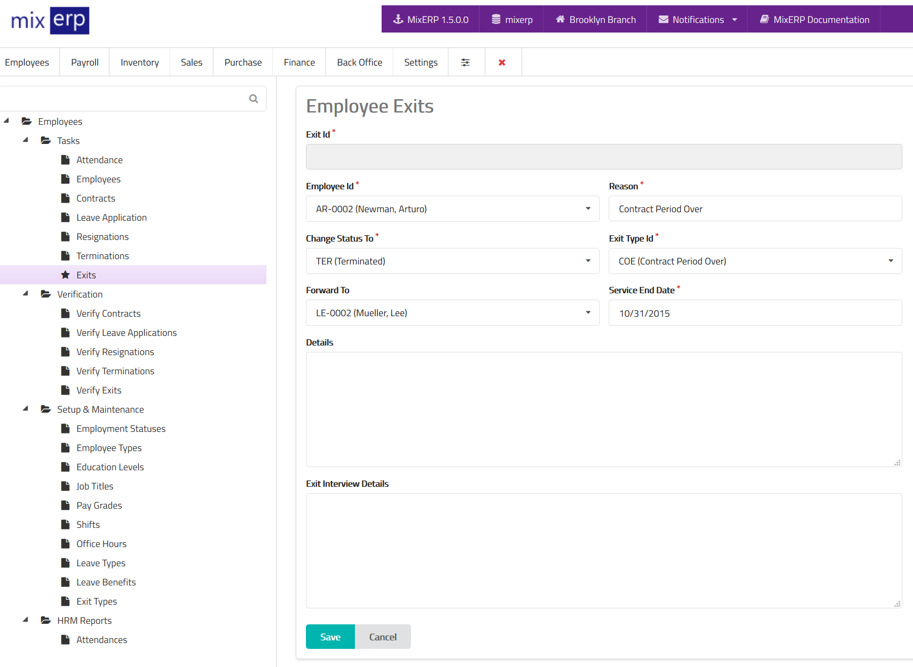

# Employee Exits

<table class="ui padded compact attached small blue table">
    <tr>
        <th>
            Exit Id
        </th>
        <td>
            This will be automatically generated.
        </td>
    </tr>
    <tr>
        <th>
            Employee Id
        </th>
        <td>
            Select the exiting employee from the list.
        </td>
    </tr>
    <tr>
        <th>Reason
        </th>
        <td>Enter the reason for exit.
        </td>
    </tr>
    <tr>
        <th>Change Status To
        </th>
        <td>
            Select employment status from the list which becomes
            effective on service end date.
        </td>
    </tr>
    <tr>
        <th>
            Exit Type Id
        </th>
        <td>
            Select the exit type from the list.
        </td>
    </tr>
    <tr>
        <th>
            Forward To
        </th>
        <td>
            Select an officer to whom you wish to forward this
            exit to.
        </td>
    </tr>
    <tr>
        <th>
            Service End Date
        </th>
        <td>
            The last date of employment.
        </td>
    </tr>
    <tr>
        <th>Details
        </th>
        <td>Enter the details of this exit.
        </td>
    </tr>
    <tr>
        <th>Exit Interview Details
        </th>
        <td>Enter the details of this exit interview.
        </td>
    </tr>
</table>

## Related Topics
* [Human Resource Management Documentation](index.md)
* [MixERP Documentation](../index.md)
