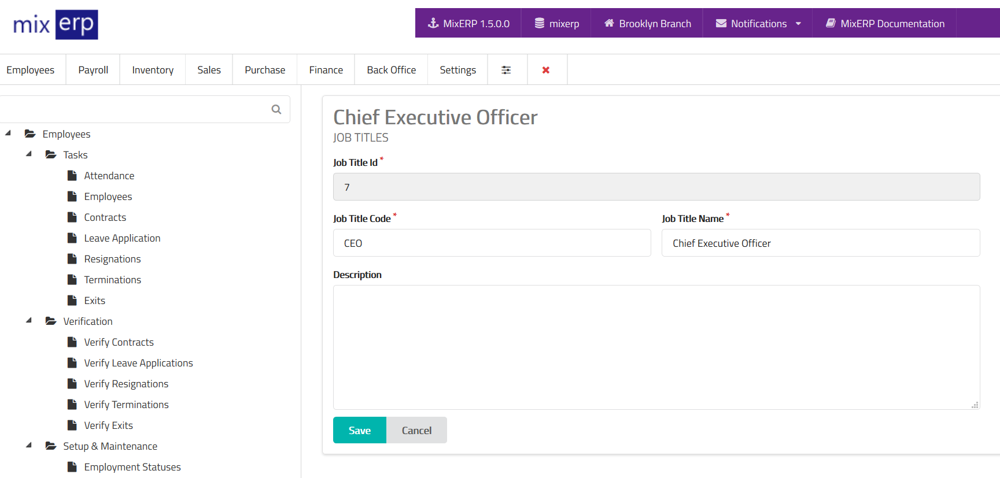

# Job Titles

<table class="ui padded compact attached small blue table">
    <tr>
        <th>
            Job Title Id
        </th>
        <td>
            This will be automatically generated.
        </td>
    </tr>
    <tr>
        <th>
            Job Title Code
        </th>
        <td>
            Enter an alpha-numeric code for this job title.
        </td>
    </tr>
    <tr>
        <th>
            Job Title Name
        </th>
        <td>
            Enter the job title name.
        </td>
    </tr>
    <tr>
        <th>Description
        </th>
        <td>
            Enter description for this job title or leave this
            field empty.
        </td>
    </tr>
</table>

## Related Topics
* [Human Resource Management Documentation](index.md)
* [MixERP Documentation](../index.md)
