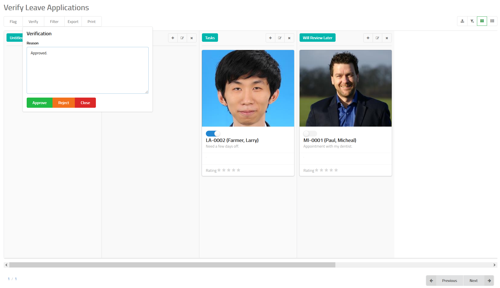

# Leave Application Verification

Once an employee applies for a leave, it is sent to the verification
queue. In the verification queue, you can decide to either
approve a leave appplication or reject it stating a reason why
you want to do that.

## How to Approve or Reject a Leave Application?

- Navigate to leave application verification feature in MixERP.
- Select the card which contains the leave application 
you want to verify by clicking on the the toggle button.
- Click **Verify** button on the top.
- Provide a reason why you are approving or rejecting this leave application.
- Click **Approve** or **Reject**.

## Related Topics
* [Human Resource Management Documentation](index.md)
* [MixERP Documentation](../index.md)
