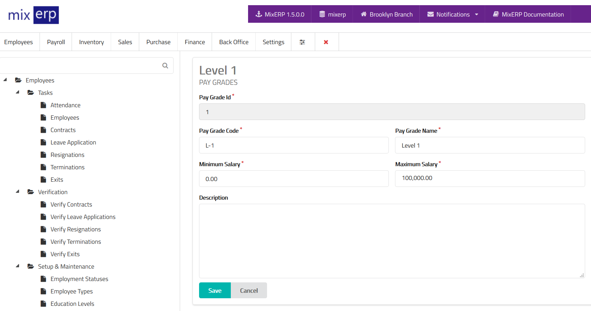

# Pay Grades

<table class="ui padded compact attached small blue table">
    <tr>
        <th>
            Pay Grade Id
        </th>
        <td>
            This will be automatically generated.
        </td>
    </tr>
    <tr>
        <th>
            Pay Grade Code
        </th>
        <td>
            Enter an alpha-numeric code for this pay grade.
        </td>
    </tr>
    <tr>
        <th>
            Pay Grade Name
        </th>
        <td>
            Enter the pay grade name.
        </td>
    </tr>
    <tr>
        <th>
            Minimum Salary
        </th>
        <td>
            Enter the minimum salary for this pay grade.
        </td>
    </tr>
    <tr>
        <th>
            Maximum Salary
        </th>
        <td>
            Enter the maximum salary for this pay grade.
        </td>
    </tr>
    <tr>
        <th>Description
        </th>
        <td>
            Enter description for this pay grade or leave this
            field empty.
        </td>
    </tr>
</table>

## Related Topics
* [Human Resource Management Documentation](index.md)
* [MixERP Documentation](../index.md)
