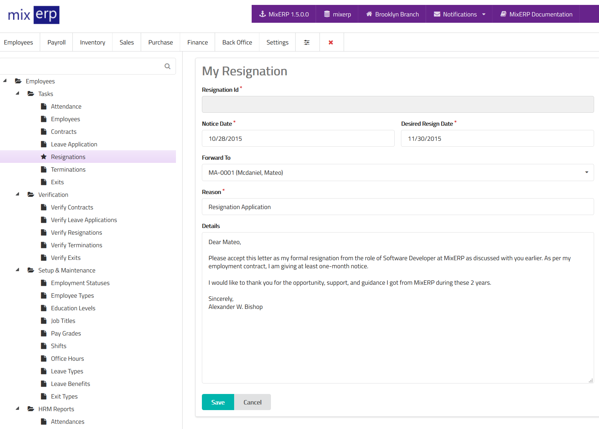

# Employee Resignation (Employee Self Service)

If you link a user with an employee, the user will be able to
apply for resignation. Please note that the resignation must be approved first in order
to become effective.

<table class="ui padded compact attached small blue table">
    <tr>
        <th>
            Resignation Id
        </th>
        <td>
            This will be automatically generated.
        </td>
    </tr>
    <tr>
        <th>
            Notice Date
        </th>
        <td>
            Date of resignation notice.
        </td>
    </tr>
    <tr>
        <th>
            Desired Resign Date
        </th>
        <td>
            The last date of employment after resigning.
        </td>
    </tr>
    <tr>
        <th>
            Forward To
        </th>
        <td>
            Select an officer to whom you wish to forward this resignation to.
        </td>
    </tr>
    <tr>
        <th>Reason
        </th>
        <td>Enter the reason for applying for resignation.
        </td>
    </tr>
    <tr>
        <th>Details
        </th>
        <td>Enter the details of this resignation.
        </td>
    </tr>
</table>

## Related Topics
* [Human Resource Management Documentation](index.md)
* [MixERP Documentation](../index.md)
