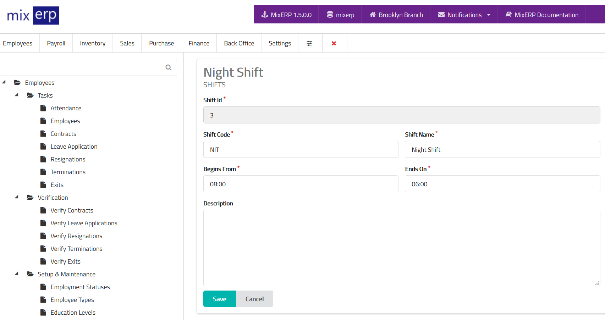

# Shifts

<table class="ui padded compact attached small blue table">
    <tr>
        <th>
            Shift Id
        </th>
        <td>
            This will be automatically generated.
        </td>
    </tr>
    <tr>
        <th>
            Shift Code
        </th>
        <td>
            Enter an alpha-numeric code for this shift.
        </td>
    </tr>
    <tr>
        <th>
            Shift Name
        </th>
        <td>
            Enter the shift name.
        </td>
    </tr>
    <tr>
        <th>
            Beings From
        </th>
        <td>
            Enter the time this shift begins from.
        </td>
    </tr>
    <tr>
        <th>
            Ends On
        </th>
        <td>
        Enter the time this shift ends on.
        </td>
    </tr>
    <tr>
    <th>Description
    </th>
    <td>
    Enter description for this shift or leave this
    field empty.
    </td>
    </tr>
</table>

## Related Topics
* [Human Resource Management Documentation](index.md)
* [MixERP Documentation](../index.md)
