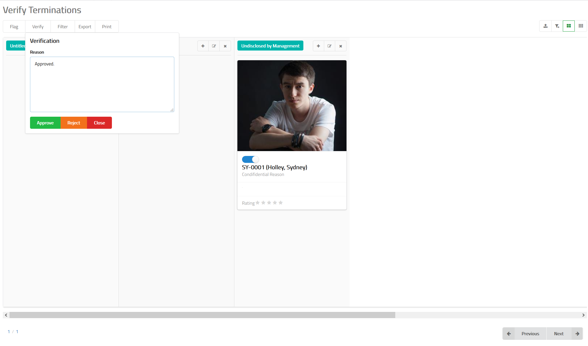

# Termination Verification

Once an employee termination is posted to MixERP, it is sent to the verification
queue. In the verification queue, you can decide to either
approve the termination or reject it stating a reason why
you want to do that.

## How to Approve or Reject a Termination?

- Navigate to termination verification feature in MixERP.
- Select the card which contains the termination
you want to verify by clicking on the the toggle button.
- Click **Verify** button on the top.
- Provide a reason why you are approving or rejecting this termination.
- Click **Approve** or **Reject**.

## Related Topics
* [Human Resource Management Documentation](index.md)
* [MixERP Documentation](../index.md)
