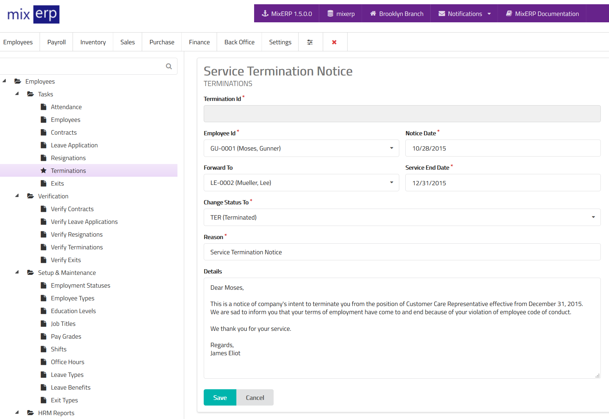

# Contact Termination

<table class="ui padded compact attached small blue table">
    <tr>
        <th>
            Termination Id
        </th>
        <td>
            This will be automatically generated.
        </td>
    </tr>
    <tr>
        <th>
            Employee Id
        </th>
        <td>
            Select the employee being terminated from the list.
        </td>
    </tr>
    <tr>
        <th>
            Notice Date
        </th>
        <td>
            Date of termination notice.
        </td>
    </tr>
    <tr>
        <th>
            Service End Date
        </th>
        <td>
            The last date of employment.
        </td>
    </tr>
    <tr>
        <th>
            Forward To
        </th>
        <td>
            Select an officer to whom you wish to forward this
            termination to.
        </td>
    </tr>
    <tr>
        <th>Reason
        </th>
        <td>Enter the reason for termination.
        </td>
    </tr>
    <tr>
        <th>Details
        </th>
        <td>Enter the details of this termination.
        </td>
    </tr>
</table>

## Related Topics
* [Human Resource Management Documentation](index.md)
* [MixERP Documentation](../index.md)
