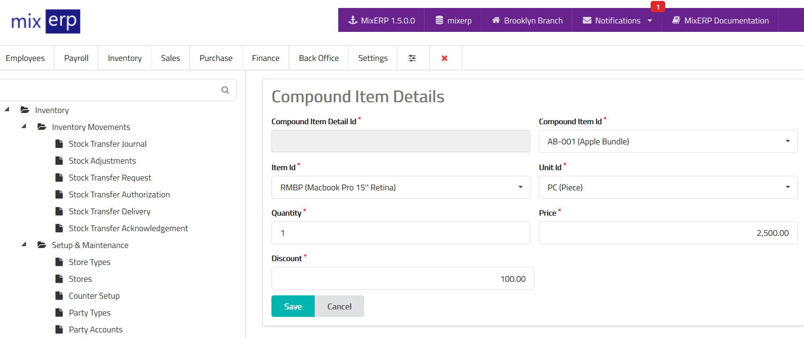

# Compound Item Details

<table class="ui padded compact attached small blue table">
    <tr>
        <th>
            Compound Item Detail Id
        </th>
        <td>
            This will be automatically generated.
        </td>
    </tr>
    <tr>
        <th>
            Compound Item Id
        </th>
        <td>
            Select the compound item from the list.
        </td>
    </tr>
    <tr>
        <th>
            Item Id
        </th>
        <td>
            Select an item from the list.
        </td>
    </tr>
    <tr>
        <th>
            Unit Id
        </th>
        <td>
            Select the unit of this item.
        </td>
    </tr>
    <tr>
        <th>
            Quantity
        </th>
        <td>
            Enter the number of the item(s) that goes into this compound item.
        </td>
    </tr>
    <tr>
        <th>
            Price
        </th>
        <td>
            Enter the price of this item as a part of compound item.
        </td>
    </tr>
    <tr>
        <th>
            Discount
        </th>
        <td>
            Enter discount provided for this item when sold as compound item.
            Set this to 0 (zero) if you do not want to provide any discount.
        </td>
    </tr>
</table>

## Related Topics
* [Inventory Management Documentation](index.md)
* [MixERP Documentation](../index.md)
