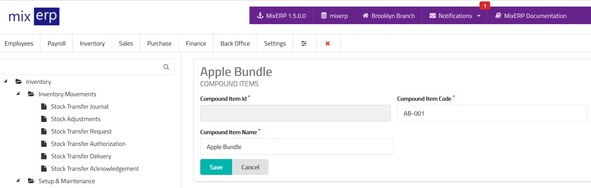

# Compound Items

<table class="ui padded compact attached small blue table">
    <tr>
        <th>
            Compound Item Id
        </th>
        <td>
            This will be automatically generated.
        </td>
    </tr>
    <tr>
        <th>
            Compound Item Code
        </th>
        <td>
            Enter an alpha-numeric code for this compound item.
        </td>
    </tr>
    <tr>
        <th>
            Compound Item Name
        </th>
        <td>
            Enter the compound item name.
        </td>
    </tr>
</table>

## Related Topics
* [Inventory Management Documentation](index.md)
* [MixERP Documentation](../index.md)
