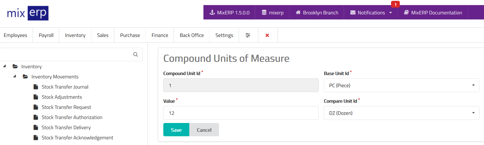

# Compound Units of Measures

<table class="ui padded compact attached small blue table">
    <tr>
        <th>
            Compound Unit Id
        </th>
        <td>
            This will be automatically generated.
        </td>
    </tr>
    <tr>
        <th>
            Base Unit Id
        </th>
        <td>
            Select the base unit of this compound unit.
        </td>
    </tr>
    <tr>
        <th>
            Value
        </th>
        <td>
            Enter the value of compound unit. For example, 12 here means 12 piece = 1 dozen.
        </td>
    </tr>
    <tr>
        <th>
            Compare Unit Id
        </th>
        <td>
            Select the compare unit of this compound unit.
        </td>
    </tr>
</table>

## Related Topics
* [Inventory Management Documentation](index.md)
* [MixERP Documentation](../index.md)
