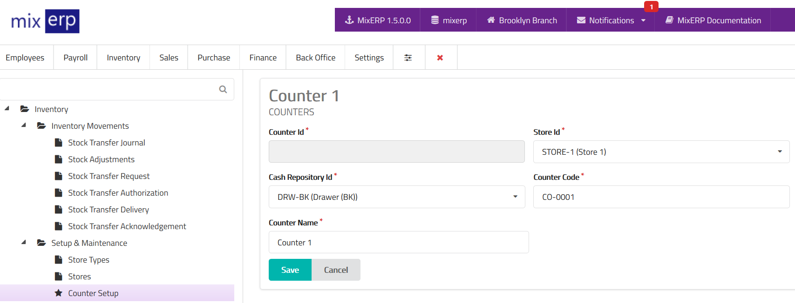

# Counters

<table class="ui padded compact attached small blue table">
    <tr>
        <th>
            Counter Id
        </th>
        <td>
            This will be automatically generated.
        </td>
    </tr>
    <tr>
        <th>
            Store Id
        </th>
        <td>
            Select a store from the list which is related to this counter.
        </td>
    </tr>
    <tr>
        <th>
            Cash Repository Id
        </th>
        <td>
            Select a cash repository from the list which is
            related to this counter.
        </td>
    </tr>
    <tr>
        <th>
            Counter Code
        </th>
        <td>
            Enter an alpha-numeric code for this counter.
        </td>
    </tr>
    <tr>
        <th>
            Counter Name
        </th>
        <td>
            Enter the counter name.
        </td>
    </tr>
</table>

## Related Topics
* [Inventory Management Documentation](index.md)
* [MixERP Documentation](../index.md)
