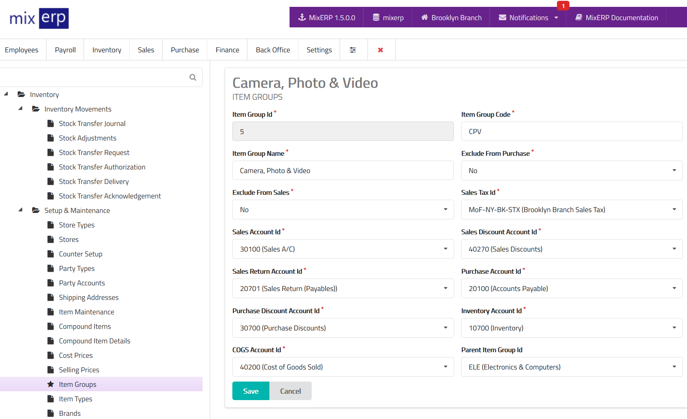

# Item Groups

<table class="ui padded compact attached small blue table">
    <tr>
        <th>
            Item Group Id
        </th>
        <td>
            This will be automatically generated.
        </td>
    </tr>
    <tr>
        <th>
            Item Group Code
        </th>
        <td>
            Enter an alpha-numeric code for this item group.
        </td>
    </tr>
    <tr>
        <th>
            Item Group Name
        </th>
        <td>
            Enter the item group name.
        </td>
    </tr>
    <tr>
        <th>
            Exclude from Purchase
        </th>
        <td>
            Set this on if you do not want the items under this group to
            appear in purchase transactions. This is useful for service items
            that you do not buy or stock.
        </td>
    </tr>
    <tr>
        <th>
            Exclude from Sales
        </th>
        <td>
            Set this on if you do not want the items under this group to
            appear in sales transactions. This is useful for raw materials
            that you only stock, but not sell.
        </td>
    </tr>
    <tr>
        <th>
            Sales Tax Id
        </th>
        <td>
            Select from the list the default <a href="../core-concepts/understanding-and-configuring-taxes.md">sales tax</a> for this item group.
        </td>
    </tr>
    <tr>
        <th>
            Sales Account Id
        </th>
        <td>
            Select an account from the list which will be picked up
            as <strong>Sales A/C</strong> for the items under this
            group during <a href="../sales/sales-delivery.md">Sales Delivery</a>
            and <a href="../sales/direct-sales.md">Direct Sales</a> entry.
        </td>
    </tr>
    <tr>
        <th>
            Sales Discount Account Id
        </th>
        <td>
            Select an account from the list which will be picked up
            as <strong>Sales Discount A/C</strong> for the items under this
            group during <a href="../sales/sales-delivery.md">Sales Delivery</a>
            and <a href="../sales/direct-sales.md">Direct Sales</a> entry.
        </td>
    </tr>
    <tr>
        <th>
            Sales Return Account Id
        </th>
        <td>
            Select an account from the list which will be picked up
            as <strong>Sales Return A/C (Account Payable)</strong> for the items under this
            group during <a href="../sales/sales-return.md">Sales Return</a> entry.
        </td>
    </tr>
    <tr>
        <th>
            Purchase Account Id
        </th>
        <td>
            Select an account from the list which will be picked up
            as <strong>Purchase A/C</strong> for the items under this
            group during <a href="../purchase/grn.md">Goods Receipt Note</a>
            and <a href="../purchase/direct-purchase.md">Direct Purchase</a> entry.
        </td>
    </tr>
    <tr>
        <th>
            Purchase Discount Account Id            
        </th>
        <td>
            Select an account from the list which will be picked up
            as <strong>Purchase Discount A/C</strong> for the items under this
            group during <a href="../purchase/grn.md">Goods Receipt Note</a>
            and <a href="../purchase/direct-purchase.md">Direct Purchase</a> entry.
        </td>
    </tr>
    <tr>
        <th>
            Inventory Account Id
        </th>
        <td>
            Select an account from the list which will be picked up
            as <strong>Inventory A/C</strong> for the items under this
            group during <a href="../sales/index.md">Sales</a>
            and <a href="../purchase/index.md">Purchase</a> entry.
        </td>
    </tr>
    <tr>
        <th>
            COGS Account Id
        </th>
        <td>
            Select an account from the list which will be picked up
            as <strong>Cost of Goods Sold A/C</strong> for the items under this
            group during <a href="../sales/sales-delivery.md">Sales Delivery</a>
            and <a href="../sales/direct-sales.md">Direct Sales</a> entry.
        </td>
    </tr>
    <tr>
        <th>
            Parent Item Group Id
        </th>
        <td>
            Select from the list an item group which become the parent
            of this item group, or leave this field empty.
        </td>
    </tr>
</table>

## Related Topics
* [Inventory Management Documentation](index.md)
* [MixERP Documentation](../index.md)
