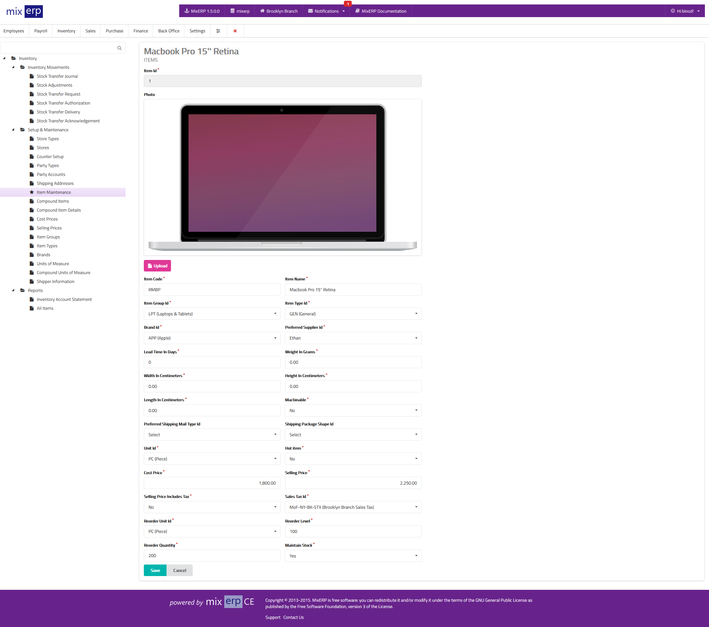

# Item Maintenance

<table class="ui padded compact attached small blue table">
    <tr>
        <th>
            Item Id
        </th>
        <td>
            This will be automatically generated.
        </td>
    </tr>
    <tr>
        <th>
            Photo
        </th>
        <td>
            Upload a photo of this item.
        </td>
    </tr>
    <tr>
        <th>
            Item Code
        </th>
        <td>
            Enter an alpha-numeric code for this item.
        </td>
    </tr>
    <tr>
        <th>
            Item Name
        </th>
        <td>
            Enter the item name.
        </td>
    </tr>
    <tr>
        <th>
            Item Group Id
        </th>
        <td>
            Select an item group from the list.
        </td>
    </tr>
    <tr>
        <th>
            Item Type Id
        </th>
        <td>
            Select an item type from the list.
        </td>
    </tr>
    <tr>
        <th>
            Brand Id
        </th>
        <td>
            Select the brand of this item from the list.
        </td>
    </tr>
    <tr>
        <th>
            Preferred Supplier Id
        </th>
        <td>
            Select a preferred supplier from the list.
            Preferred suppliers are picked when creating
            automated purchase orders.
        </td>
    </tr>
    <tr>
        <th>
            Lead Time In Days
        </th>
        <td>
            Enter the lead time of this item.
        </td>
    </tr>
    <tr>
        <th>
            Weight in Grams
        </th>
        <td>
            Enter the weight of this item in grams.
        </td>
    </tr>
    <tr>
        <th>
            Width in Centimeters
        </th>
        <td>
            Enter the width of this item.
        </td>
    </tr>
    <tr>
        <th>
            Height in Centimeters
        </th>
        <td>
            Enter the height of this item.
        </td>
    </tr>
    <tr>
        <th>
            Length in Centimeters
        </th>
        <td>
            Enter the length of this item.
        </td>
    </tr>
    <tr>
        <th>
            Machinable
        </th>
        <td>
            State whether or not this item is a machinable parcel
            for shipping.
        </td>
    </tr>
    <tr>
        <th>
            Preferred Shipping Mail Type Id
        </th>
        <td>
            Select the preferred shipping mail type of this item.
        </td>
    </tr>
    <tr>
        <th>
            Shipping Package Shape Id
        </th>
        <td>
            Select the shipping package shape of this item.
        </td>
    </tr>
    <tr>
        <th>
            Unit Id
        </th>
        <td>
            Select the default unit of measure of this item.
        </td>
    </tr>
    <tr>
        <th>
            Hot Item
        </th>
        <td>
            State whether or not this is a hot item.
        </td>
    </tr>
    <tr>
        <th>
            Cost Price
        </th>
        <td>
            Enter the default cost price of this item. Please note that
            you can set <a href="cost-prices.md">dynamic item cost prices</a>.
        </td>
    </tr>
    <tr>
        <th>
            Selling Price
        </th>
        <td>
            Enter the default selling price of this item. Please note that
            you can set <a href="selling-prices.md">dynamic item selling prices</a>.
        </td>
    </tr>
    <tr>
        <th>
            Selling Price Includes Tax
        </th>
        <td>
            State whether or not the selling price of this item is
            inclusive of sales taxes.
        </td>
    </tr>
    <tr>
        <th>
            Sales Tax Id
        </th>
        <td>
            Select a default sales tax for this item.
        </td>
    </tr>
    <tr>
        <th>
            Reorder Unit Id
        </th>
        <td>
            Select a unit from the list. The reorder unit is picked
            when creating automated purchase reorders.
        </td>
    </tr>
    <tr>
        <th>
            Reorder Level
        </th>
        <td>
            Enter the minimum number of this item to be in stock.
            When this level is reached, MixERP will suggest you
            to create purchase orders.
        </td>
    </tr>
    <tr>
        <th>
            Reorder Quantity
        </th>
        <td>
            Enter the number of items in the <strong>Reorder Unit</strong>
            which will be picked to create purchase reorders.
        </td>
    </tr>
    <tr>
        <th>
            Maintain Stock
        </th>
        <td>
            State whether or not you want MixERP to maintain stock for
            this item. Set this off for service items.
        </td>
    </tr>
</table>

## Related Topics
* [Inventory Management Documentation](index.md)
* [MixERP Documentation](../index.md)
