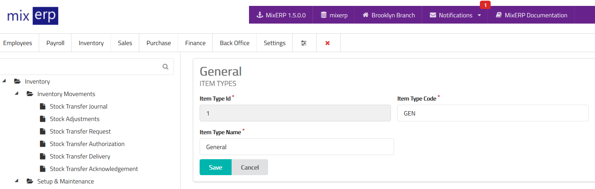

# Item Types

<table class="ui padded compact attached small blue table">
    <tr>
        <th>
            Item Type Id
        </th>
        <td>
            This will be automatically generated.
        </td>
    </tr>
    <tr>
        <th>
            Item Type Code
        </th>
        <td>
            Enter an alpha-numeric code for this item type.
        </td>
    </tr>
    <tr>
        <th>
            Item Type Name
        </th>
        <td>
            Enter the item type name.
        </td>
    </tr>
</table>

## Related Topics
* [Inventory Management Documentation](index.md)
* [MixERP Documentation](../index.md)
