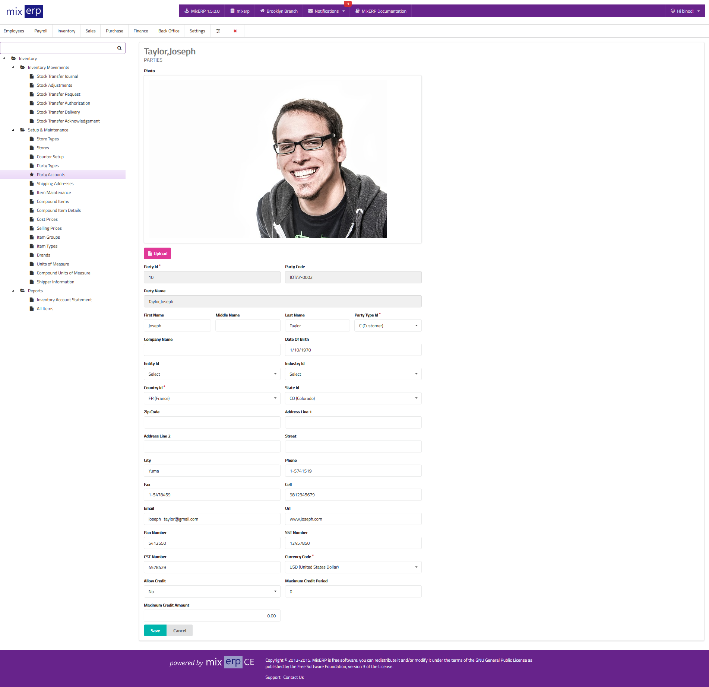

# Party Accounts

<table class="ui padded compact attached small blue table">
    <tr>
        <th>
            Party Id
        </th>
        <td>
            This will be automatically generated.
        </td>
    </tr>
    <tr>
        <th>
            Photo
        </th>
        <td>
            Upload a photo of this party.
        </td>
    </tr>
    <tr>
        <th>
            Party Code
        </th>
        <td>
            This will be automatically generated.
        </td>
    </tr>
    <tr>
        <th>
            Party Name
        </th>
        <td>
            This will be automatically generated.
        </td>
    </tr>
    <tr>
        <th>
            First Name
        </th>
        <td>
            Enter the first name of this party.
        </td>
    </tr>
    <tr>
        <th>
            Middle Name
        </th>
        <td>
            Enter the middle name of this party.
        </td>
    </tr>
    <tr>
        <th>
            Last Name
        </th>
        <td>
            Enter the last name of this party.
        </td>
    </tr>
    <tr>
        <th>
            Party Type
        </th>
        <td>
            Select a party type from the list.
        </td>
    </tr>
    <tr>
        <th>
            Company Name
        </th>
        <td>
            Enter the company name of the party or leave this field empty.
        </td>
    </tr>
    <tr>
        <th>
            Date of Birth
        </th>
        <td>
            Enter the date of birth of this party or leave this field empty.
        </td>
    </tr>
    <tr>
        <th>
            Entity Id
        </th>
        <td>
            Select the business entity of this party or leave this field empty.
        </td>
    </tr>
    <tr>
        <th>
            Industry Id
        </th>
        <td>
            Select the business industry of this party or leave this field empty.
        </td>
    </tr>
    <tr>
        <th>
            Country Id
        </th>
        <td>
            Select the country from the list.
        </td>
    </tr>
    <tr>
        <th>
            State Id
        </th>
        <td>
            Select the state from the list or leave this field empty..
        </td>
    </tr>
    <tr>
        <th>
            Zip Code
        </th>
        <td>
            Enter zip code information of this party or leave this field empty..
        </td>
    </tr>
    <tr>
        <th>
            Address Line 1
        </th>
        <td>
            Enter line 1 address of this party or leave this field empty..
        </td>
    </tr>
    <tr>
        <th>
            Address Line 2
        </th>
        <td>
            Enter line 2 address of this party or leave this field empty..
        </td>
    </tr>
    <tr>
        <th>
            Street
        </th>
        <td>
            Enter the street of this party or leave this field empty.
        </td>
    </tr>
    <tr>
        <th>
            City
        </th>
        <td>
            Enter the city of this party or leave this field empty.
        </td>
    </tr>
    <tr>
        <th>
            Phone
        </th>
        <td>
            Enter the phone number of this party or leave this field empty.
        </td>
    </tr>
    <tr>
        <th>
            Fax
        </th>
        <td>
            Enter the fax number of this party or leave this field empty.
        </td>
    </tr>
    <tr>
        <th>
            Cell
        </th>
        <td>
            Enter the cell number (mobile) of the party or leave this field empty.
        </td>
    </tr>
    <tr>
        <th>
            Email
        </th>
        <td>
            Enter the email address of this party or leave this field empty.
        </td>
    </tr>
    <tr>
        <th>
            Url
        </th>
        <td>
            Enter the website URL address of this party or leave this field empty.
        </td>
    </tr>
    <tr>
        <th>Pan Number</th>
        <td>
            Enter the business Permanent Account Number of this party or leave this field empty.
        </td>
    </tr>
    <tr>
        <th>
            SST Number
        </th>
        <td>
            Enter the State Sales Tax Number of this party or leave this field empty.
        </td>
    </tr>
    <tr>
        <th>
            CST Number
        </th>
        <td>
            Enter the Central Sales Tax Number of this party or leave this field empty.
        </td>
    </tr>
    <tr>
        <th>
            Currency Code
        </th>
        <td>
            Enter the currency code of this party.
        </td>
    </tr>
    <tr>
        <th>
            Allow Credit
        </th>
        <td>
            State whether or not credit is allowed to this customer.
        </td>
    </tr>
    <tr>
        <th>
            Maximum Credit Period
        </th>
        <td>
            Enter the maximum number of days of credit of this party.
            After this period, the credit amount becomes due and may
            attract fine, late fee, or penalty.
        </td>
    </tr>
    <tr>
        <th>
            Maximum Credit Amount
        </th>
        <td>
            Enter the maximum amount of credit allowed to this party.
        </td>
    </tr>
</table>

## Related Topics
* [Inventory Management Documentation](index.md)
* [MixERP Documentation](../index.md)
