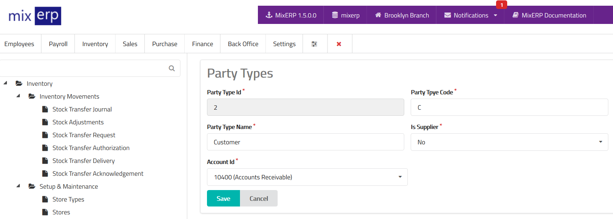

# Party Types

<table class="ui padded compact attached small blue table">
    <tr>
        <th>
            Party Type Id
        </th>
        <td>
            This will be automatically generated.
        </td>
    </tr>
    <tr>
        <th>
            Party Type Code
        </th>
        <td>
            Enter an alpha-numeric code for this party type.
        </td>
    </tr>
    <tr>
        <th>
            Party Type Name
        </th>
        <td>
            Enter the party type name.
        </td>
    </tr>
    <tr>
        <th>Is Supplier</th>
        <td>Set this on if this party type is supplier.</td>
    </tr>
    <tr>
        <th>Account Id</th>
        <td>Select an account from the list. This account will be used as the parent account for parties created under this party type.</td>
    </tr>
</table>

## Related Topics
* [Inventory Management Documentation](index.md)
* [MixERP Documentation](../index.md)
