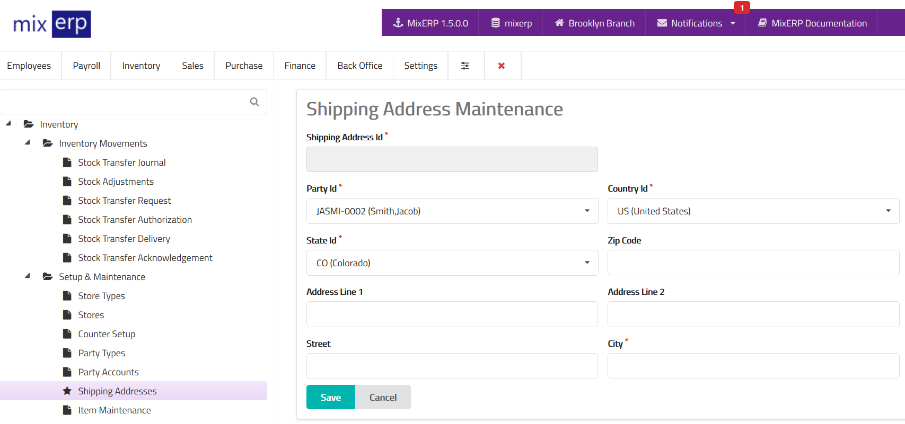

# Shipping Addresses

<table class="ui padded compact attached small blue table">
    <tr>
        <th>
            Shipping Address Id
        </th>
        <td>
            This will be automatically generated.
        </td>
    </tr>
    <tr>
        <th>
            Party Id
        </th>
        <td>
            Select a party from the list.
        </td>
    </tr>
    <tr>
        <th>
            Country Id
        </th>
        <td>
            Select a country from the list.
        </td>
    </tr>
    <tr>
        <th>State Id
        </th>
        <td>Select a state from the list.
        </td>
    </tr>
    <tr>
        <th>Zip Code
        </th>
        <td>Enter the zip code for this shipping address.
        </td>
    </tr>
    <tr>
        <th>Address Line 1
        </th>
        <td>Enter the line 1 address or leave this field empty.
        </td>
    </tr>
    <tr>
        <th>Address Line 2
        </th>
        <td>Enter the line 2 address or leave this field empty.
        </td>
    </tr>
    <tr>
        <th>Street
        </th>
        <td>Enter the name of the street.
        </td>
    </tr>
    <tr>
        <th>City
        </th>
        <td>Enter the name of the city.
        </td>
    </tr>
</table>

## Related Topics
* [Inventory Management Documentation](index.md)
* [MixERP Documentation](../index.md)
