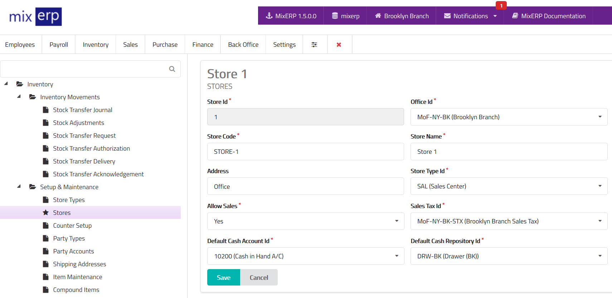

# Stores

<table class="ui padded compact attached small blue table">
    <tr>
        <th>
            Store Id
        </th>
        <td>
            This will be automatically generated.
        </td>
    </tr>
    <tr>
        <th>
            Office Id
        </th>
        <td>
            Select the office related to this store.
        </td>
    </tr>
    <tr>
        <th>
            Store Code
        </th>
        <td>
            Enter an alpha-numeric code for this store.
        </td>
    </tr>
    <tr>
        <th>
            Store Name
        </th>
        <td>
            Enter the store name.
        </td>
    </tr>
    <tr>
        <th>
            Address
        </th>
        <td>
            Enter the address of this store.
        </td>
    </tr>
    <tr>
        <th>
            Store Type Id
        </th>
        <td>
            Select a store type from the list.
        </td>
    </tr>
    <tr>
        <th>
            Allow Sales
        </th>
        <td>
            State whether or not you can sell items from this store.
        </td>
    </tr>
    <tr>
        <th>
            Sales Tax Id
        </th>
        <td>
             Select from the list the default <a href="../core-concepts/understanding-and-configuring-taxes.md">sales tax</a> for this item group.
        </td>
    </tr>
    <tr>
        <th>
            Default Cash Account Id
        </th>
        <td>
            Select an account from list which will be used as
            <strong>Cash A/C</strong> during direct sales and purchase.
        </td>
    </tr>
    <tr>
        <th>
            Default Cash Repository Id
        </th>
        <td>
            Select a cash repository which will be used for
            <strong>cash in/out</strong> during direct sales and purchase.
        </td>
    </tr>
</table>

## Related Topics

* [Sales Tax](../core-concepts/tax/sales-tax.md)
* [Understanding & Configuring Taxes](../core-concepts/understanding-and-configuring-taxes.md)