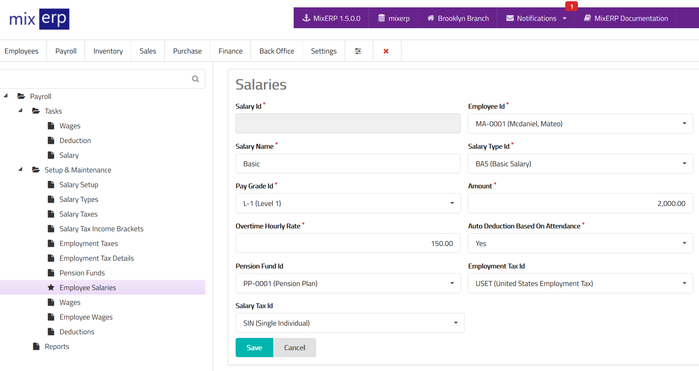

# Employee Salaries

MixERP payroll has a complete salary system.
You can create unlimited number of salary items for
a given employee. Each salary item can have its own implementation
for the following:

- absenteeism deduction
- overtime addition
- pension plans
- salary taxes
- employment taxes

<table class="ui padded compact attached small blue table">
    <tr>
        <th>
            Salary Id
        </th>
        <td>
            This will be automatically generated.
        </td>
    </tr>
    <tr>
        <th>
            Employee Id
        </th>
        <td>
            Select an employee from the list.
        </td>
    </tr>
    <tr>
        <th>
            Salary Name
        </th>
        <td>
            Provide a friendly name for this salary item.
        </td>
    </tr>
    <tr>
        <th>Salary Type Id
        </th>
        <td>
            Select a salary type from the list.
        </td>
    </tr>
    <tr>
        <th>Pay Grade Id
        </th>
        <td>Select a pay grade from the list.
        </td>
    </tr>
    <tr>
        <th>Amount
        </th>
        <td>
            Enter the salary amount in <a href="salary-setup.md">salary setup currency</a>.
        </td>
    </tr>
    <tr>
        <th>Overtime Hourly Rate
        </th>
        <td>
            Enter an overtime rate in amount for this salary item.
            Remember that an employee can have multiple salary items
            with different overtime rates. You can set this to 0 (zero)
            if you want to keep this salary item from creating an overtime
            entry during salary posting.
        </td>
    </tr>
    <tr>
        <th>Auto Deduction Based On Attendance</th>
        <td>
            Specify whether or not this salary item attracts deduction
            for days not worked.
        </td>
    </tr>
    <tr>
        <th>Pension Fund Id</th>
        <td>
            Select a pension fund from the list. Remember than an employee
            can have multiple salary items with different (or no)
            pension funds. You can leave this field empty if you do not want
            to link this salary item to a pension fund.
        </td>
    </tr>
    <tr>
        <th>Employment Tax Id</th>
        <td>
            Select an employment tax from the list or leave this field
            empty if this salary item is nontaxable.
        </td>
    </tr>
    <tr>
        <th>Salary Tax Id</th>
        <td>
            Select a salary tax from the list or leave this field
            empty if this salary item is nontaxable.
        </td>
    </tr>
</table>

## Related Topics
* [Salary Setup](salary-setup.md)
* [Payroll Management Documentation](index.md)
* [MixERP Documentation](../index.md)
