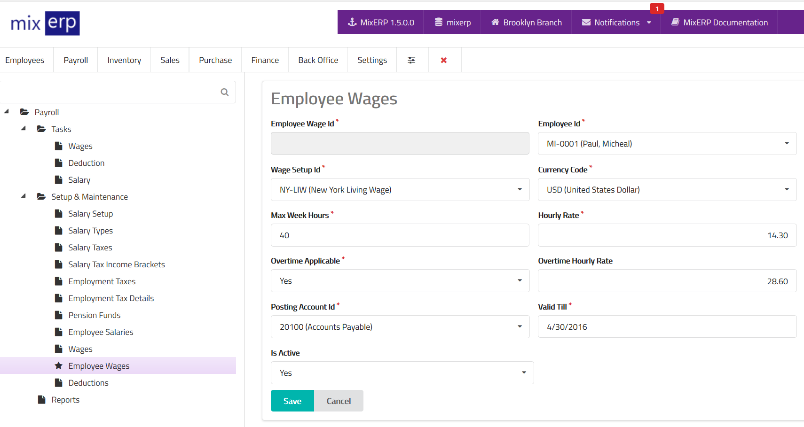

# Employee Wages

<table class="ui padded compact attached small blue table">
    <tr>
        <th>
            Employee Wage Id
        </th>
        <td>
            This will be automatically generated.
        </td>
    </tr>
    <tr>
        <th>
            Employee Id
        </th>
        <td>
            Select an employee from the list.
        </td>
    </tr>
    <tr>
        <th>Wage Setup Id</th>
        <td>Select a wage setup from the list.</td>
    </tr>
    <tr>
        <th>
            Currency Code
        </th>
        <td>
            Select currency for this wage setup.
        </td>
    </tr>
    <tr>
        <th>Expense Account Id
        </th>
        <td>
            Select an account from the list. This account is a wage
            expense account.
        </td>
    </tr>
    <tr>
        <th>Max Week Hours</th>
        <td>
            Enter the maximum number of hours in the week
            considered as regular work hours.
            </td>
            </tr>
        <tr>
        <th>
            Hourly Rate
        </th>
        <td>
            Enter the regular wage rate in currency amount.
        </td>
        </tr>
        <tr>
        <th>Overtime Applicable</th>
            <td>
                Set this on if you want to allow overtime work
                under this wage setup.
                </td>
        </tr>
        <tr>
        <th>Overtime Hourly Rate</th>
        <td>Enter the overtime wage rate in currency amount.</td>
        </tr>
        <tr>
        <th>Posting Account Id</th>
        <td>Select an account on which the wage will be posted (credited) to.</td>
        </tr>
        <tr>
        <th>Valid Till</th>
        <td>Enter the date till this wage information is valid.</td>
        </tr>
        <tr>
        <th>Is Active</th>
        <td>
            Set this on if you want to use this wage information
            during wage posting of this employee.
        </td>
        </tr>
</table>

## Related Topics
* [Payroll Management Documentation](index.md)
* [MixERP Documentation](../index.md)
