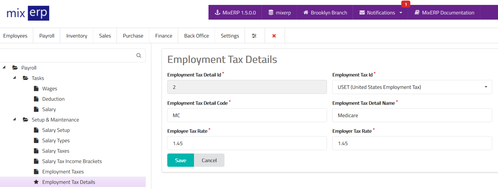

# Employment Tax Details

<table class="ui padded compact attached small blue table">
    <tr>
        <th>
            Employment Tax Detail Id
        </th>
        <td>
            This will be automatically generated.
        </td>
    </tr>
    <tr>
        <th>
            Employment Tax Id
        </th>
        <td>
            Select an employment tax from the list.
        </td>
    </tr>
    <tr>
        <th>
            Employment Tax Detail Code
        </th>
        <td>
            Enter an alpha-numeric code for this employment tax detail.
        </td>
    </tr>
    <tr>
        <th>
            Employment Tax Detail Name
        </th>
        <td>
            Enter the employment tax detail name.
        </td>
    </tr>
    <tr>
        <th>Employee Tax Rate
        </th>
        <td>
            Enter the income tax rate without the percent (%) symbol.
            This tax will be deducted from employee salary.
        </td>
    </tr>
    <tr>
        <th>Employer Tax Rate
        </th>
        <td>
            Enter the income tax rate without the percent (%) symbol.
            This tax is an added expense of the employer.
        </td>
    </tr>
</table>

## Related Topics
* [Employment Taxes](employment-taxes.md)
* [Payroll Management Documentation](index.md)
* [MixERP Documentation](../index.md)