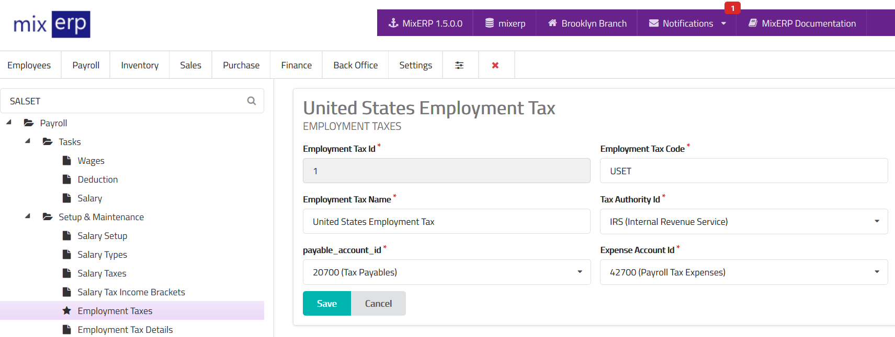

# Employment Taxes

<table class="ui padded compact attached small blue table">
    <tr>
        <th>
            Employment Tax Id
        </th>
        <td>
            This will be automatically generated.
        </td>
    </tr>
    <tr>
        <th>
            Employment Tax Code
        </th>
        <td>
            Enter an alpha-numeric code for this employment tax.
        </td>
    </tr>
    <tr>
        <th>
            Employment Tax Name
        </th>
        <td>
            Enter the employment tax name.
        </td>
    </tr>
    <tr>
        <th>Tax Authority Id
        </th>
        <td>Select a tax authority from the list.
        </td>
    </tr>
    <tr>
        <th>Payable Account Id
        </th>
        <td>
            Select an account from the list on which the tax
            amount will be credited to.
        </td>
    </tr>
    <tr>
        <th>Expense Account Id
        </th>
        <td>
            Not only is an employment tax deducted from the salary of the employees,
            but also it is paid by the employer in addition to the former. Select an expense
            account from the list from where the employment tax
            amount will be debited.
        </td>
    </tr>
</table>

## Related Topics
* [Employment Tax Details](employment-tax-details.md)
* [Payroll Management Documentation](index.md)
* [MixERP Documentation](../index.md)