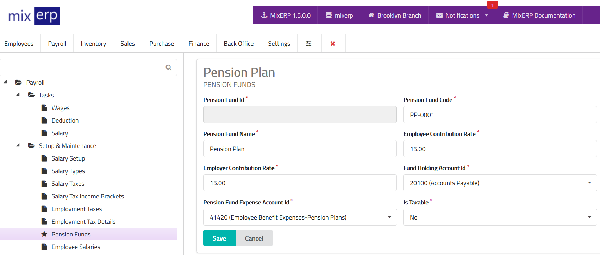

# Pension Funds

<table class="ui padded compact attached small blue table">
    <tr>
        <th>
            Pension Fund Id
        </th>
        <td>
            This will be automatically generated.
        </td>
    </tr>
    <tr>
        <th>
            Pension Fund Code
        </th>
        <td>
            Enter an alpha-numeric code for this pension fund.
        </td>
    </tr>
    <tr>
        <th>
            Pension Fund Name
        </th>
        <td>
            Enter the pension fund name.
        </td>
    </tr>
    <tr>
        <th>
            Employee Contribution Rate
        </th>
        <td>
            Enter the rate without the percent (%) symbol
            which will be deducted from salary and posted to pension fund
            holding account.
        </td>
    </tr>
    <tr>
        <th>
            Employer Contribution Rate
        </th>
        <td>
            Enter the rate without the percent (%) symbol
            which will be posted to pension fund holding account
            at an expense of the employer.
        </td>
    </tr>
    <tr>
        <th>Fund Holding Account Id
        </th>
        <td>
            Select a liability account from the list. This account will hold
            pension fund transactions.
        </td>
    </tr>
    <tr>
        <th>Pension Fund Expense Account Id
        </th>
        <td>
            Select an expense account from the list which will be
            used to debit employer contribution of this pension fund.
        </td>
    </tr>
    <tr>
        <th>Is Taxable
        </th>
        <td>
            State whether or not the deductions related to this pension fund
            are taxable. If you specify this pension fund as
            taxable, the <strong>deductions will appear after</strong> taxable
            salary items. Whereas nontaxable <strong>deductions will appear
            along with</strong> the taxable salary item, thus reducing the total
            taxable earnings.
        </td>
    </tr>
</table>

## Related Topics
* [Payroll Management Documentation](index.md)
* [MixERP Documentation](../index.md)
