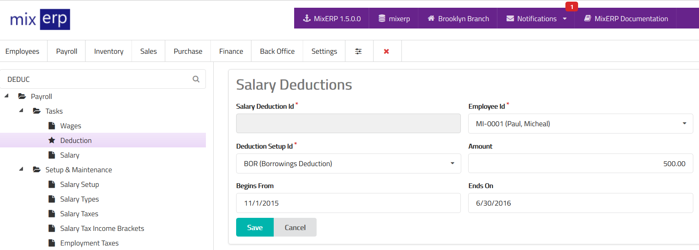

# Salary Deductions

<table class="ui padded compact attached small blue table">
    <tr>
        <th>
            Salary Deduction Id
        </th>
        <td>
            This will be automatically generated.
        </td>
    </tr>
    <tr>
        <th>
            Employee Id
        </th>
        <td>
            Select an employee from the list.
        </td>
    </tr>
    <tr>
        <th>
            Deduction Setup Id
        </th>
        <td>
            Select the type of deduction from the list.
        </td>
    </tr>
    <tr>
        <th>Amount
        </th>
        <td>
            Enter the amount in <a href="salary-setup.md">salary setup currency</a> to be deducted
            during salary posting.
        </td>
    </tr>
    <tr>
        <th>
            Begins From
        </th>
        <td>
            Enter the starting date of this deduction.
        </td>
    </tr>
    <tr>
        <th>
            Ends On
        </th>
        <td>
            Enter the date on which this deduction will end.
        </td>
    </tr>
</table>

## Related Topics
* [Payroll Management Documentation](index.md)
* [MixERP Documentation](../index.md)