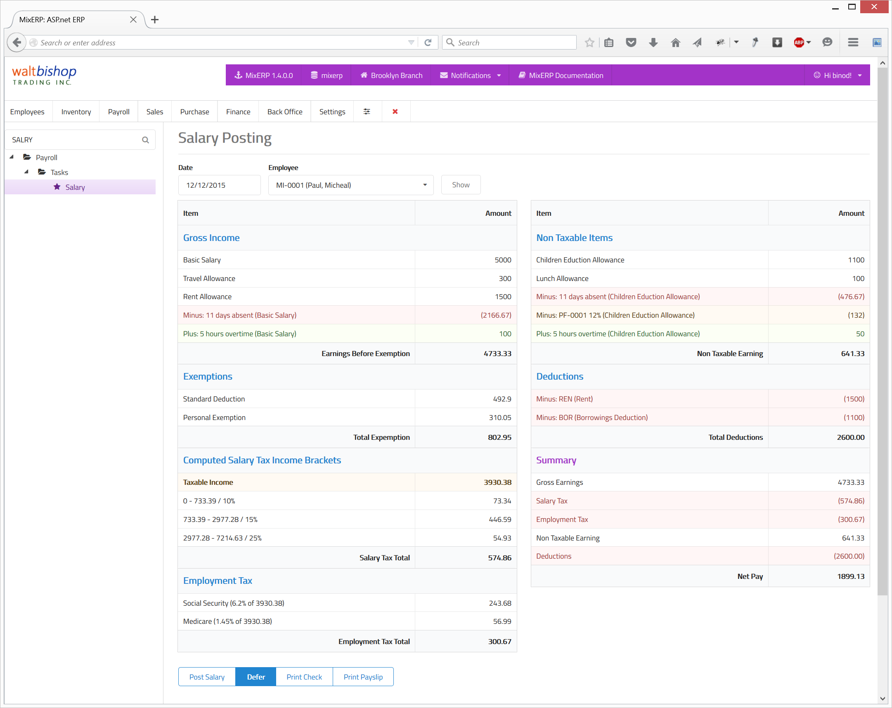

# Salary Posting

Select an employee and the date of salary. Click the show button.

<table class="ui padded compact attached small blue table">
    <tr>
        <th>
            Earnings Before Exemption
        </th>
        <td>
            This includes all taxable salary items. Depending on how
            you configured each salary item, absenteeism deduction
            and/or overtime addition may appear here.   
            Similarly, <strong>non taxable pension fund items</strong> may also appear here.
        </td>
    </tr>
    <tr>
        <th>
            Exemptions
        </th>
        <td>
            Exemptions, if applicable to your country, will appear here.
            For example, the United States Government provides
            exemptions depending on your filing status (standard deduction)
            and number of your dependents (personal exemption).
        </td>
    </tr>
    <tr>
        <th>Taxable Income
        </th>
        <td>
            Taxable income means total taxable earnings minus
            all applicable exemptions.
        </td>
    </tr>
    <tr>
        <th>Salary Tax
        </th>
        <td>
            Salary tax is computed against income brackets. The income
            brackets are converted from year to
            whatever you have in <a href="salary-setup.md">salary setup frequency</a>.
        </td>
    </tr>
    <tr>
        <th>Employment Tax
        </th>
        <td>
            Not only employment tax is deducted from the employee's salary,
            but also the employer needs to make an additional expense entries.   
            Currently, there are two employment taxes in the United States:
            <ul>
                <li>Social Security Contribution (6.2%)</li>
                <li>Medicare (1.45%)</li>
            </ul>
        </td>
    </tr>
    <tr>
        <th>Non Taxable Earning
        </th>
        <td>
            This includes all non taxable salary items. Depending on how
            you configured each salary item, absenteeism deduction
            and/or overtime addition may appear here.   
            Similarly, <strong>taxable pension fund items</strong> may also appear here.
        </td>
    </tr>
    <tr>
        <th>Deductions
        </th>
        <td>
            This includes deduction items related to this employee.
        </td>
    </tr>
    <tr>
        <th>Net Pay
        </th>
        <td>
            Net pay is the net amount earned by the employee after all
            taxes and deductions. MixERP, being a full-fledged accounting
            and payroll management software, posts each individual payroll
            items during GL posting instead of merely posting just the net pay.
        </td>
    </tr>
</table>

## Related Topics
* [Payroll Management Documentation](index.md)
* [MixERP Documentation](../index.md)
