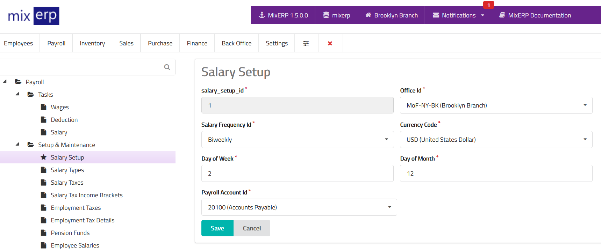

# Salary Setup

<table class="ui padded compact attached small blue table">
    <tr>
        <th>
            Salary Setup Id
        </th>
        <td>
            This will be automatically generated.
        </td>
    </tr>
    <tr>
        <th>
            Office Id
        </th>
        <td>
            Select an office from the list on which you are performing
            salary setup.
        </td>
    </tr>
    <tr>
        <th>
            Salary Frequency Id
        </th>
        <td>
            Specify how frequently this office posts salary.
        </td>
    </tr>
    <tr>
        <th>Currency Code
        </th>
        <td>
            Select a currency from the list which will be used as default
            salary posting currency for this office.
        </td>
    </tr>
    <tr>
        <th>Day of Week
        </th>
        <td>Enter the day of week on which salary posting will occur.
        </td>
    </tr>
    <tr>
        <th>Day of Month
        </th>
        <td>
            Enter the day of month on (the multiple of) which
            salary posting will occur.
        </td>
    </tr>
    <tr>
        <th>Payroll Account Id
        </th>
        <td>Select the default account where salary will be posted (credited) to.
        You can override the payroll account while <a href="..//human-resource-management/employee-managment.md">creating an employee</a>.
        </td>
    </tr>
</table>

## Related Topics
* [Employee Management](..//human-resource-management/employee-managment.md)
* [Payroll Management Documentation](index.md)
* [MixERP Documentation](../index.md)
