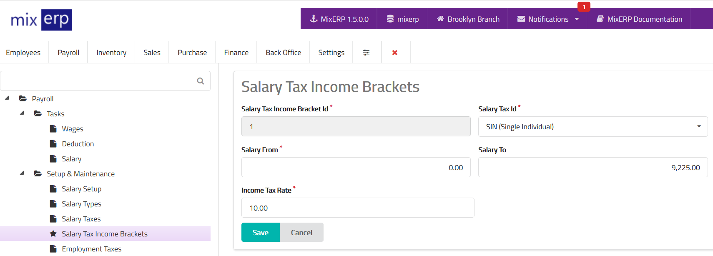

# Salary Tax Income Brackets

<table class="ui padded compact attached small blue table">
    <tr>
        <th>
            Salary Tax Income Bracket Id
        </th>
        <td>
            This will be automatically generated.
        </td>
    </tr>
    <tr>
        <th>
            Salary Tax Id
        </th>
        <td>
            Select a salary tax from the list.
        </td>
    </tr>
    <tr>
        <th>
            Salary From
        </th>
        <td>
            Enter the starting salary for this bracket.
        </td>
    </tr>
    <tr>
        <th>Salary Tax To
        </th>
        <td>Enter the ending salary for this bracket.
        </td>
    </tr>
    <tr>
        <th>Income Tax Rate
        </th>
        <td>
            Enter the income tax rate without the percent (%) symbol.
        </td>
    </tr>
</table>

## Related Topics
* [Salary Taxes](salary-taxes.md)
* [Payroll Management Documentation](index.md)
* [MixERP Documentation](../index.md)