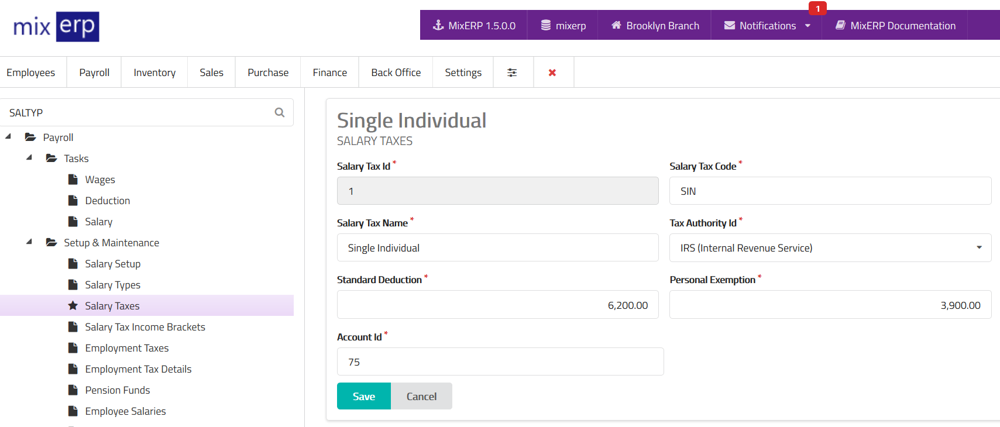

# Salary Taxes

<table class="ui padded compact attached small blue table">
    <tr>
        <th>
            Salary Tax Id
        </th>
        <td>
            This will be automatically generated.
        </td>
    </tr>
    <tr>
        <th>
            Salary Tax Code
        </th>
        <td>
            Enter an alpha-numeric code for this salary tax.
        </td>
    </tr>
    <tr>
        <th>
            Salary Tax Name
        </th>
        <td>
            Enter the salary tax name.
        </td>
    </tr>
    <tr>
        <th>Tax Authority Id
        </th>
        <td>Select a tax authority from the list.
        </td>
    </tr>
    <tr>
        <th>Standard Deduction
        </th>
        <td>
            Enter the amount in your home currency that reduces
            the taxable income as <a href="https://en.wikipedia.org/wiki/Standard_deduction" target="_blank">standard deduction</a>.
        </td>
    </tr>
    <tr>
        <th>Personal Exemption
        </th>
        <td>
            Enter the amount in your home currency that reduces
            the taxable income as <a href="https://en.wikipedia.org/wiki/Personal_exemption_%28United_States%29" target="_blank">personal exemption</a>.
        </td>
    </tr>
    <tr>
        <th>Account Id
        </th>
        <td>
            Select an account from the list on which the tax
            amount will be credited to.
        </td>
    </tr>
</table>

## Related Topics
* [Salary Tax Income Brackets](salary-tax-income-brackets.md)
* [Payroll Management Documentation](index.md)
* [MixERP Documentation](../index.md)