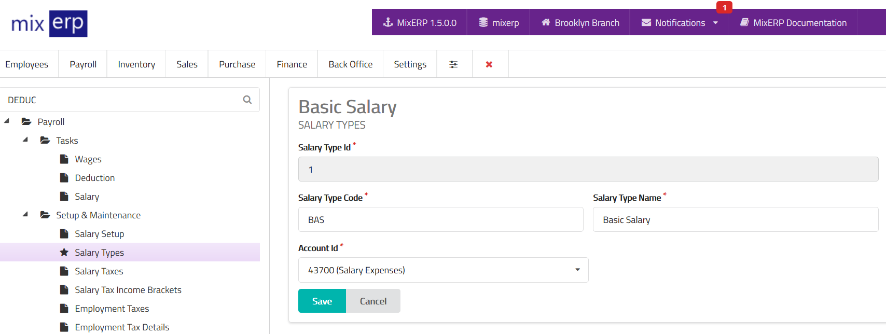

# Salary Types

<table class="ui padded compact attached small blue table">
    <tr>
        <th>
            Salary Type Id
        </th>
        <td>
            This will be automatically generated.
        </td>
    </tr>
    <tr>
        <th>
            Salary Type Code
        </th>
        <td>
            Enter an alpha-numeric code for this salary type.
        </td>
    </tr>
    <tr>
        <th>
            Salary Type Name
        </th>
        <td>
            Enter the salary type name.
        </td>
    </tr>
    <tr>
        <th>Account Id
        </th>
        <td>Select an account from the list. This account is a salary
        expense account.
        </td>
    </tr>
</table>

## Related Topics
* [Payroll Management Documentation](index.md)
* [MixERP Documentation](../index.md)
