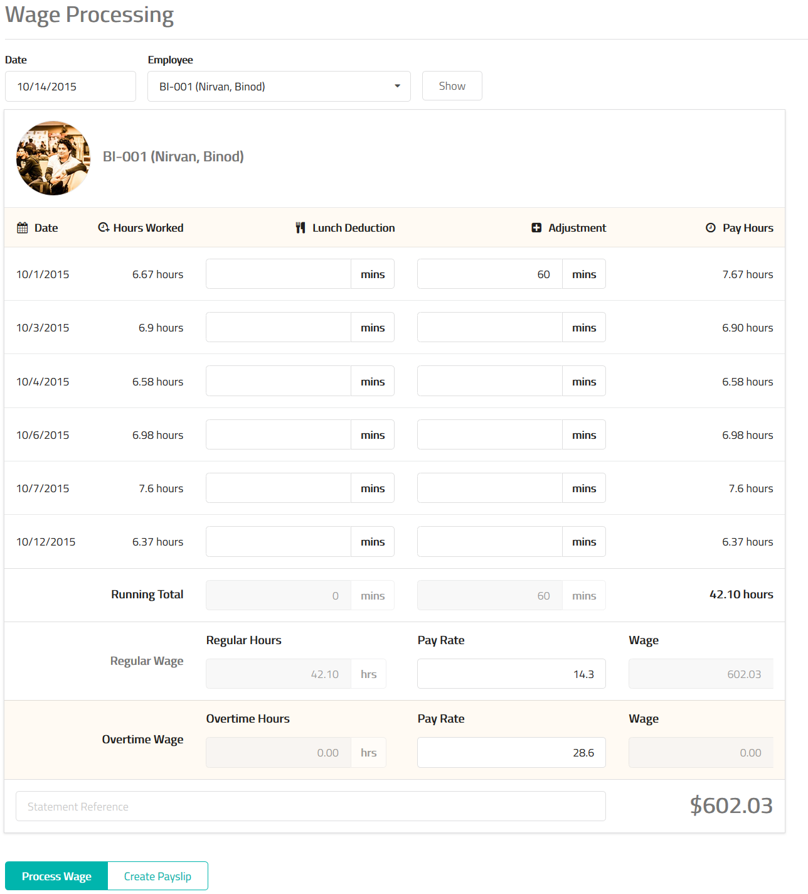

# Wage Processing

Select an employee and the date of wage processing. Click the show button.

## Information

<table class="ui padded compact attached small blue table">
    <tr>
        <th>
            Date
        </th>
        <td>
            The work day of the employee.
        </td>
    </tr>
    <tr>
        <th>
            Hours Worked
        </th>
        <td>
            The number of hours worked by the employee in the work day.
        </td>
    </tr>
    <tr>
        <th>
            Lunch Deduction
        </th>
        <td>
            Lunch hours spent during the shift can be deducted if required.
            Enter the number of minutes spent on lunch or leave this field empty.
        </td>
    </tr>
    <tr>
        <th>
            Adjustment
        </th>
        <td>
            MixERP allows payroll adjustments so that it would be
            added to the actual pay hours.
            This can be useful in cases when you need to make
            the last minute adjustment to the payroll.
        </td>
    </tr>
    <tr>
        <th>
            Pay Hours
        </th>
        <td>
            The pay hours for this work day.
        </td>
    </tr>
</table>

## Summary

<table class="ui padded compact attached small blue table">
    <tr>
        <th>
            Running Total
        </th>
        <td>
            The sum of lunch deduction, adjustment, and pay hours
            during this work period.
        </td>
    </tr>
    <tr>
        <th>
            Regular Wage: Hours
        </th>
        <td>
            Regular hours extracted from the total work hours.
        </td>
    </tr>
    <tr>
        <th>Regular Wage: Pay Rate
        </th>
        <td>The pay rate of regular hours.
        </td>
    </tr>
    <tr>
        <th>Regular Wage: Wage
        </th>
        <td>The total regular wage earned.
        </td>
    </tr>
    <tr>
        <th>
            Overtime Wage: Hours
        </th>
        <td>
            Overtime hours extracted from the total work hours.
        </td>
    </tr>
    <tr>
        <th>Overtime Wage: Pay Rate
        </th>
        <td>The pay rate of overtime hours.
        </td>
    </tr>
    <tr>
        <th>Overtime Wage: Wage
        </th>
        <td>The total overtime wage earned.
        </td>
    </tr>
    <tr>
        <th>Statement Reference
        </th>
        <td>
            Enter statement reference which will be display on the wage
            account.
        </td>
    </tr>
    <tr>
        <th>Dollar Amount
        </th>
        <td>The final wage payment to be processed.
        </td>
    </tr>
</table>

## Related Topics
* [Payroll Management Documentation](index.md)
* [MixERP Documentation](../index.md)
